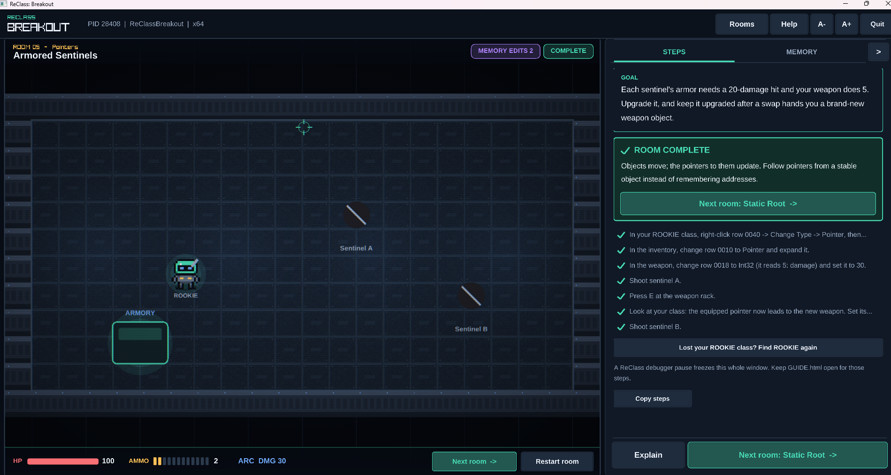

# ReClass.NET Next

Inspect memory, reconstruct native objects, discover the code that uses them, and
apply reversible instruction patches. This revamp extends ReClass.NET with a
guided debugger and patching workflow, reproducible Windows/Linux x64 packages,
and **ReClass: Breakout**—an included game designed to teach the complete toolset.

> **Platform status:** this revamp has only been tested on **Windows x64**.
> The build also produces a Linux x64 package, but its runtime behavior is not
> currently verified and it should be considered experimental. Linux and other
> operating systems or CPU architectures may require additional work; no support
> claim is made for non-x64 platforms.

[](images/image.png)

*ReClass: Breakout running the Armored Sentinels lesson. The game tracks the
result of edits made in ReClass and guides the player through each technique.*

## What's in this revamp

- **Memory discovery:** scan exact or changing values, filter results, inspect raw
  memory, and highlight changes as they happen.
- **Structure reconstruction:** turn nearby bytes into typed fields, arrays,
  strings, enums, bit flags, pointers, and reusable classes.
- **Write and access discovery:** find the instructions touching a field, confirm
  the next execution, and inspect captured operands and registers.
- **Assembly and hex editing:** edit x64 instructions with the bundled offline
  NASM assembler, preview the byte-level change, and safely NOP-pad shorter
  replacements.
- **Reversible patches and hooks:** apply in-place patches or prepare longer
  before/after/replacement hooks, then restore the original code.
- **Conditions, stepping, and traces:** filter watch events with expressions,
  pause on a match, step into code, capture bounded traces, and export them to
  CSV.
- **Persistent patch definitions:** save a patch by module offset or byte pattern,
  resolve it in a fresh process, and explicitly reapply it after review.
- **Portable builds:** create complete Windows x64 and Linux x64 packages through
  one Docker Compose build, including native libraries, tools, licenses, and the
  tutorial game.

ReClass.NET still includes its established memory viewer, class address
calculator, pointer preview, RTTI and debug-symbol support, code generation,
module/section dumping, process control, and plugin system. See the
[original project overview](docs/UPSTREAM_README.md) for that broader feature set.

## Learn it in ReClass: Breakout

Breakout is a deliberately inspectable native x64 game bundled under `Demo/` in
both release packages. Across 14 guided rooms, you play ROOKIE, a maintenance
robot escaping a memory research facility. The in-game controls alone cannot
solve the rooms: progress comes from attaching ReClass and changing the game's
real data or code.

The game keeps the learning loop visible:

- The **Steps** panel separates actions to take in the game from actions to take
  in ReClass and explains the expected result.
- The **Memory** panel exposes live values, types, addresses, pointer paths, and
  module offsets as an optional answer key.
- External edits flash as **MEMORY WRITE DETECTED**, while observable successful
  outcomes complete a room.
- Hints, solutions, address reveals, repeatable actions, and room resets make each
  experiment deterministic. An offline HTML/Markdown guide remains readable when
  the debugger has suspended the game.
- The campaign builds on itself: the ROOKIE class created in the structure lesson
  becomes the starting point for pointers, code discovery, hooks, and saved
  patches.

### Feature-to-room tour

| ReClass workflow | What Breakout asks you to do | Rooms |
|---|---|---|
| Attach and scan | Attach to the displayed PID, find ammo exactly, then narrow a float with increased/decreased/unchanged scans | 0–2 |
| Build structures | Start a class from a known field and identify adjacent health, speed, bytes, and bit flags | 3–4 |
| Follow pointers | Walk `ROOKIE → Inventory → Weapon`, survive a replaced object, and find a stable module-rooted path | 5–6 |
| Find writes and patch code | Capture and confirm a health writer, NOP it, then change an ammo decrement into an increment | 7–8 |
| Find reads | Watch the instruction that reads a callsign and recover a comparison value from the surrounding code | 9 |
| Filter and inspect events | Apply a player-only condition, pause on a match, and read the value carried in `r9` | 10 |
| Build a longer hook | Insert code that heals ROOKIE when firing while leaving the shared enemy path unchanged | 11 |
| Step and trace | Follow a short decision routine, inspect registers and flags, stop at a known endpoint, and export CSV | 12 |
| Save and resolve patches | Restart the process, resolve inactive definitions by module offset and byte pattern, then apply and restore them | 13 |

Rooms 0–9 form the main path; rooms 10–13 are an optional advanced chapter. See
the [full game guide](docs/DEMO.md) for controls, exact lesson descriptions,
restoration rules, and direct room launch options.

### Start the tutorial

1. Extract one of the release packages and start ReClass.NET.
2. Start `Demo/ReClassBreakout.exe` on Windows or `Demo/run-demo.sh` on Linux.
3. In ReClass, attach to the process name and PID displayed at the top of the
   game window.
4. Follow the **Steps** panel, beginning with Room 0 if this is your first time.

The game requires OpenGL 3.3. Linux additionally needs the X11/XWayland graphics
libraries documented in the package. Docker and build tools are not needed to
play a packaged release.

> **Patching reminder:** resetting a room resets gameplay data, not executable
> code changed from ReClass. Use **Restore original** or **Restore all** before
> leaving a patching exercise. Restarting the game creates a fresh process and
> discards its old hook allocations.

## Build everything with Docker

### Prerequisites

Install Docker Engine or Docker Desktop with the Compose v2 plugin—the command
should be `docker compose`, not the older `docker-compose`. Docker Desktop must be
using Linux containers. Run the commands below from the repository root, where
`compose.yaml` is located.

The build pipeline targets an x64/amd64 Linux container engine. Building on
another CPU architecture requires Docker emulation and has not been validated.
This describes the container used to compile the packages, not validation of the
Linux desktop application. The first build also needs internet access to download
the pinned base images and source dependencies.

Nothing else needs to be installed on the host: the .NET/Mono toolchain, GCC,
MinGW, CMake, Python generators, NASM build, and packaging utilities all run
inside the containers.

### Create both release packages

Run this one command in a terminal or PowerShell window:

```bash
docker compose run --build --rm build
```

It builds and packages the complete project:

1. ReClass.NET and its launcher in x64 Release configuration.
2. The native ReClass core for Linux x64 and Windows x64.
3. The pinned offline NASM assembler for both platforms.
4. ReClass: Breakout for Linux x64 and Windows x64, including its generated
   lesson guide and memory-layout reference.
5. The final archives, dependency/license records, build manifest, and checksums.
6. Static package checks for architecture, required files, native exports,
   runtime imports, and the supported Linux glibc baseline.

The temporary build container is removed when it finishes. Docker keeps the
image-layer cache, so later builds only rebuild stages affected by source
changes.

On a Linux host, pass your user and group IDs so files exported to `dist/` are
owned by your account. `SOURCE_REVISION` is an optional label for the manifest:

```bash
HOST_UID="$(id -u)" HOST_GID="$(id -g)" SOURCE_REVISION="$(git rev-parse HEAD)" \
  docker compose run --build --rm build
```

With Docker Desktop, use the first command; the UID/GID override is unnecessary.

### Build outputs

Successful builds place these files in `dist/` on the host:

```text
ReClass.NET_Next-windows-x64.zip
ReClass.NET_Next-linux-x64.tar.gz
build-manifest.json
native-build-packages.txt
SHA256SUMS
```

The archives include ReClass.NET, the matching native library, managed
dependencies, the pinned offline NASM assembler, dependency hashes and licenses,
an empty `Plugins` directory, runtime instructions, and ReClass: Breakout with
its offline guides. Windows also includes its existing x64 symbol-server DLL.
Compiler runtimes are statically linked into the Windows native core, so it needs
no separate MinGW or Visual C++ runtime.

To force a completely uncached rebuild when diagnosing a toolchain or dependency
problem, rebuild the service image and then run its exporter:

```bash
docker compose build --no-cache build
docker compose run --rm build
```

The manifest always records a hash of the actual build-context file contents,
including uncommitted edits. `SOURCE_REVISION` is an optional label, not a claim
that the tree was clean. Base image digests are pinned and installed native
package/compiler versions are recorded. Distribution repositories supply other
dependencies; timestamps and package updates mean archives are not promised to
be byte-for-byte reproducible.

## Run the packages

**Windows 11 x64:** extract the complete ZIP and open `ReClass.NET.exe`. Windows
11's installed .NET Framework 4.8/4.8.1 satisfies the application's 4.7.2 target.
Docker and build tools are unnecessary on the destination computer.

**Linux x64 (experimental and unverified):** extract the archive and run
`./run.sh`. This is expected to require glibc 2.35 or newer, Mono 6.8 or newer
with WinForms, libgdiplus, fonts, and an X11 display. On Wayland desktops, enable
XWayland. The current revamp has not been runtime-tested on Linux, so behavior may
differ or additional dependencies and fixes may be needed.

Ubuntu 22.04/24.04 or Debian 12/13:

```bash
sudo apt-get install mono-devel libgdiplus fonts-liberation
```

Fedora 43/44:

```bash
sudo dnf install mono-devel mono-winforms libgdiplus liberation-fonts
```

`mono-devel` supplies the managed libraries and the compiler used by the address
calculator. The modern .NET SDK alone cannot run this Mono WinForms application.
These are archive packages with runtime prerequisites; Mono is not bundled.

The app may need additional permissions to inspect some processes. Launch
scripts never change ptrace policy, capabilities, elevation settings, or other
system security controls. Only x64 processes and matching platform plugins are
supported by these packages. The original launcher and x86 project settings
remain in the source, but the release archives launch the x64 application
directly.

## Verify

```bash
docker compose run --build --rm test
bash docker/check-compat.sh
```

`test` runs artifact/checksum checks, the original x64 xUnit suite, native and
managed process/memory integration checks, a project save/load round-trip, a GUI
startup check under Xvfb, and launcher path/argument checks. The build command
itself checks binary architecture, native exports, package contents, glibc
baseline, and runtime dependencies before exporting.

`check-compat.sh` installs runtime prerequisites in pinned Ubuntu 22.04/24.04,
Debian 12/13, and Fedora 43/44 containers, then exercises the **same exported
Linux archive**. It requires an existing successful export. GUI tests use a
virtual X11 display; native desktop appearance and Wayland integration still
need manual review.

Windows packages are cross-compiled and statically inspected on Linux. This does
**not** substitute for Windows runtime validation. See the
[build validation history](docs/VALIDATION.md), [debugger validation](docs/DEBUGGER_VALIDATION.md),
and [Breakout validation](docs/DEMO_VALIDATION.md) for the recorded acceptance
scope and results.

## Documentation

- [ReClass: Breakout guide](docs/DEMO.md)
- [Debugger, instruction editing, hooks, and saved patches](docs/DEBUGGER.md)
- [Build and runtime validation](docs/VALIDATION.md)
- [Original ReClass.NET README and credits](docs/UPSTREAM_README.md)
- [Implementation roadmaps](planning/)

## Project background and limitations

The starting source is the modified local checkout of
[chrisjd20/ReClass.NET](https://github.com/chrisjd20/ReClass.NET), commit
`a99973f33680efa4c0fb933da3f7750a49c91009`. The original upstream is
[ReClassNET/ReClass.NET](https://github.com/ReClassNET/ReClass.NET). See
[SOURCE.json](SOURCE.json) and the [MIT license](LICENSE).

Linux retains unrelated upstream gaps: Windows PDB symbol loading and several
desktop integrations are unavailable, and global keyboard polling is stubbed.
The advanced debugger uses a new all-thread ptrace backend; legacy plugin entry
points remain compatible. Automatic hooks reject unsupported instruction
layouts, and published hook allocations remain in the target until it exits.
ARM, macOS, x86 releases, bundled Mono, UI modernization, installers, and
dedicated Wine/Proton support are outside the current scope.
