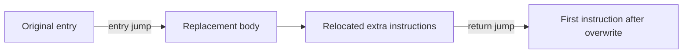

# Debugger, assembly editor, and reversible patching roadmap

Status: implementation specification; features described as new work are not implemented.

Audit date: 2026-09-29. Audited repository revision: `38584a4fbb25bfdf57f914c07452ba04a5bcdae7`.

## 1. Authority, deliverable, and intended outcome

The task that produced this document was **read-only source auditing and writing this document only**. It did not authorize feature implementation, dependency changes, builds, tests, commits, or pushes. An AI asked to revise or finish this planning document must maintain that boundary. Feature implementation requires a subsequent instruction to implement the roadmap.

The intended product workflow is:

> Find a value → find the instructions changing it → inspect and understand those instructions → edit assembly or bytes → preview the change → apply it → restore the original behavior.

The motivating example is changing an instruction that decrements an ammo value into one that increments it. The original request and screenshots are recorded in [upstream issue 224](https://github.com/ReClassNET/ReClass.NET/issues/224). That screenshot used an x86 ReClass build; the implementation described here targets **x64 processes on Windows x64 and native Linux x64**.

The user selected **Windows first, followed by required Linux parity**. Share the architecture from the beginning, complete the Windows workflow, and then implement the Linux backend against the same contracts. Linux parity, longer replacements, and the additional debugging features in this document are required milestones, not optional ideas.

### Fixed boundaries

- Keep .NET Framework 4.7.2, WinForms, Mono on Linux, and the existing Docker Compose build/export model.
- Ship an offline text assembler with the application. No assembler installation or runtime internet access should be required.
- Use deterministic local explanations for supported instructions. Do not add an LLM service, credentials, natural-language code generation, or a decompiler.
- Include assembly/hex editing, in-place patches, hooks, restoration, saved patches, access discovery in both directions, register navigation, conditions, and bounded tracing.
- Exclude ARM, macOS, x86 releases and targets, dedicated Wine/Proton support, kernel debugging, complete Cheat Engine script compatibility, and unrelated UI or framework migration.
- Do not expand this into pointer scanning, a trainer generator, arbitrary scripting, disk executable rewriting, or complete Cheat Engine feature parity.
- Treat all patches as changes to a running process. Persist definitions, not automatic process modifications.

### Testing constraint — applies to future implementation

The user explicitly requires minimal testing. **Do not run tests during documentation work.** During implementation, consolidate validation at the completed Windows feature milestone and at Linux parity/final packaging. Reuse a small controlled target and a small set of focused cases. Do not repeatedly run the full legacy suite, add a large test framework, or repeat the existing six-distribution matrix. Section 13 defines the complete validation budget.

## 2. Current repository audit

These are source-inspection findings, not claims that the existing debugger was exercised successfully. The previous build/package validation does not establish runtime debugger or patching correctness.

| Area and source | Observed baseline | Required consequence |
| --- | --- | --- |
| [Scanner](../ReClass.NET/Forms/ScannerForm.cs), [linked actions](../ReClass.NET/UI/LinkedWindowFeatures.cs), [main-form actions](../ReClass.NET/Forms/MainForm.Functions.cs) | Scanner results and structure nodes already expose find-write/find-access commands. | Extend these entry points rather than creating a separate scanner. |
| [RemoteDebugger](../ReClass.NET/Debugger/RemoteDebugger.cs) | Installs hardware watchpoints and opens `FoundCodeForm`. `AddBreakpoint` ignores the boolean result of installation. A split watch range can run out of slots and leave only partial coverage. | Make watch installation all-or-nothing, report failures, and share slot ownership across features. |
| [Debugger thread](../ReClass.NET/Debugger/RemoteDebugger.Thread.cs) | Starting the worker is reported before successful native attachment. Events are initially marked handled. Termination, breakpoint removal, and worker joining share locks. | Introduce explicit session state, attachment completion, event classification, serialized operations, and deadlock-free shutdown. |
| [Instruction finder](../ReClass.NET/Forms/FoundCodeForm.cs) | Displays hit counts, five surrounding instructions, and a register snapshot. Groups hits by exception address and infers the preceding instruction. Uses synchronous UI invocation from event delivery. | Separate capture from presentation; add reliable identities, boundary confidence, null/read-error handling, and asynchronous UI updates. |
| [Disassembler](../ReClass.NET/Memory/Disassembler.cs), [diStorm adapter](../NativeCore/Shared/DistormHelper.cpp) | Decodes bytes and heuristically searches backward for prior instructions/function starts. Decode mode follows build bitness. | Keep compatibility paths, but use structured decoding and explicit origin for new inspection, assembly, and relocation. Backward decoding is not proof of a boundary. |
| [Windows debugger](../NativeCore/Windows/Debugger.cpp) | Uses Windows debug events and thread contexts. Some native failures are unchecked; breakpoint installation operates on a thread snapshot. | Track current and newly created threads, distinguish owned exceptions, and report actual operation success. |
| [Linux debugger](../NativeCore/Unix/Debugger.cpp) | Attachment contains an all-thread TODO and returns `false`; detach also has an all-thread TODO. Wait timeouts use process-wide alarm state. | Implement a complete per-thread ptrace session and replace alarm-based waiting. This is substantive work, not a packaging adjustment. |
| [Windows memory writer](../NativeCore/Windows/WriteRemoteMemory.cpp) | Changes protection and writes bytes, but restoration is only attempted on a successful write path; no instruction-cache flush is present. | Add a dedicated coordinated code-write transaction with per-region restoration and cache handling. |
| [Linux memory writer](../NativeCore/Unix/WriteRemoteMemory.cpp) | Uses `process_vm_writev`, suitable for permitted writable memory. | Add a ptrace-backed executable-memory path plus controlled allocation/protection operations; ordinary memory writing does not provide hook support. |
| [Core provider contract](../ReClass.NET/Core/ICoreProcessFunctions.cs), [native wrapper](../ReClass.NET/Core/NativeCoreWrapper.cs), [plugin header](../NativeCore/ReClassNET_Plugin.hpp) | Existing plugin interfaces and native exports expose basic process/memory/debug operations. Native delegates are resolved as mandatory exports. | Introduce optional versioned capabilities without changing old interface layouts or requiring old plugins to export new functions. |
| [Software breakpoint](../ReClass.NET/Debugger/SoftwareBreakpoint.cs), [event handler](../ReClass.NET/Debugger/RemoteDebugger.Handler.cs) | A software-breakpoint class writes/restores `0xCC`, while the existing handler routes hardware-register matches. | A complete INT3 restore/step/reinsert cycle still needs implementation; the class is not a complete tracing backend. |
| [Pattern scanner](../ReClass.NET/MemoryScanner/PatternScanner.cs) | Returns the first match, reads a requested range into one buffer, and uses a loop that excludes the final valid starting position. | Add bounded all-match/unique-match scanning and correct boundary handling for saved-patch resolution. |
| [Project](../ReClass.NET/Project/ReClassNetProject.cs), [custom data](../ReClass.NET/Util/CustomDataMap.cs), [project writer](../ReClass.NET/DataExchange/ReClass/ReClassNetFile.Write.cs), [reader](../ReClass.NET/DataExchange/ReClass/ReClassNetFile.Read.cs) | Existing project archives serialize string-valued custom data, including XML through helper methods. | Store versioned patch definitions in that extension point and load them inactive. |
| [Project definition](../ReClass.NET/ReClass.NET.csproj) | Source inclusion is explicit. Some files on disk are not compiled; `ProcessMemoryViewForm.cs`, for example, is not an active project entry. | Verify project membership before selecting UI integration points; explicitly include new sources/resources. |
| [Dockerfile](../docker/Dockerfile), [packaging](../docker/package.py), [artifact verification](../docker/verify-artifacts.py) | Builds Mono-managed code and Linux/MinGW native cores, packages platform artifacts, and verifies exports/dependencies. | Add the assembler and managed instruction library through these existing stages. Update expected optional/new core exports deliberately. |

Do not repair unrelated legacy issues during feature implementation. Confirm these findings at implementation start if the repository revision has changed; do not redo a broad audit when it has not.

## 3. Product behavior and acceptance examples

### 3.1 Basic edit: decrement becomes increment

1. Attach to a controlled x64 target and locate a changing integer through the existing scanner.
2. Name it `Ammo`, then select **Find what writes to this address**.
3. Trigger the change in the target. A result row shows the responsible code address, module offset, bytes, assembly, count, and thread.
4. Open the instruction inspector. Keep the watched data address and instruction address visibly distinct.
5. Choose **Edit assembly** and replace `dec dword [rax]` with `inc dword [rax]`.
6. The preview shows the original and replacement assembly, `FF 08` versus `FF 00` for this example, sizes, and overwrite span.
7. Apply the change. Subsequent executions increase the value if this is the responsible update and other code does not overwrite it.
8. Choose **Restore original**. Future executions use the original instruction again.

This example uses a 64-bit pointer register and a 32-bit data operand. Data width and process address width are separate concepts.

### 3.2 Longer replacement

Select a two-byte instruction and enter a replacement sequence too large for that selection. In-place Apply stays disabled. The editor offers **Create hook**; it never silently expands the selection or overwrites following instructions.

The hook preview shows the user-selected replacement, any additional complete instructions needed for the entry jump, the replacement body, relocated extra instructions, and the return address. Preparing a hook may reserve remote memory as explained in section 7; preparing does not redirect execution.

After Apply, execution goes through the replacement body and returns correctly. Restore removes the entry redirection. Memory that may still be referenced by target threads is retained until process exit under the explicit lifetime policy below.

### 3.3 Shared code and reverse discovery

An instruction may update both the player's object and other objects. **Find addresses accessed by this instruction** records the actual addresses accessed during observed executions, with counts and register context. The user can follow each address into ReClass, identify object fields, and use conditions or custom hook logic to distinguish objects.

Do not automatically call one object the player or assume that a patch affects only the originally watched address.

### 3.4 Instruction explanations

Use templates for `mov`, `lea`, `inc`, `dec`, `add`, `sub`, `cmp`, `test`, ordinary jumps, `call`, `ret`, and `nop`. Describe operand widths, pointer dereferences, and relevant register/flag effects using decoded metadata. For example:

> Subtract 1 from the 32-bit value stored at the address in RAX. The captured address corresponds to your label “Ammo”.

For other instructions, show available operand/register/flag metadata and “Plain-language explanation unavailable.” Do not invent behavior. Hex/assembly editing remains fully usable without a prose explanation.

## 4. Architecture and compatibility

### 4.1 Ownership boundaries

Keep UI forms thin. Introduce shared managed services under the application's existing namespaces:

| Service | Responsibility |
| --- | --- |
| `InstructionService` | Decode exact bytes, format NASM text, inspect operands, and provide explanation metadata. |
| `AssemblyService` | Assemble user text at an explicit origin, return bytes and line diagnostics, and manage the bundled assembler subprocess. |
| `DebugSession` | Own attachment, event processing, thread state, breakpoint slots, command serialization, snapshots, stepping, and cleanup. |
| `PatchPlanner` | Resolve a target, validate boundaries, construct in-place/hook previews, and relocate displaced instructions. |
| `PatchManager` | Own active patch intervals, original bytes, apply/restore transactions, and hook allocations. |
| `PatchRepository` | Convert saved definitions to/from project custom data; distinguish definitions from active process state. |

`RemoteProcess` remains the user-visible process abstraction. Give each successful open a new session identifier and native process identity/start marker. A PID alone is not an identity. Process close, provider change, module replacement, or target exec invalidates affected previews and transient state.

One debugger worker owns native debugger calls and a command queue per target. Commands from the UI return tasks/results; they do not directly mutate thread contexts. Native callbacks never call WinForms synchronously while holding session locks. Queue immutable snapshots and update views with `BeginInvoke`/a UI timer.

### 4.2 Instruction dependencies

Use **Iced 1.21.0** for the new managed decoder, NASM formatter, instruction information, and `BlockEncoder` relocation. Use **NASM 3.02** for text-to-bytes assembly. Iced's programmatic assembler is not a parser for arbitrary typed assembly, which is why NASM is also required.

These choices fit the existing .NET Framework target, use permissive licenses, and provide one text dialect across both platforms. Retain diStorm and existing native disassembly exports for existing callers; do not combine this feature work with removal of the old disassembler.

Pin the versions above. Obtain official release artifacts/source checksums during implementation and record actual verified values in build metadata; never insert invented hashes. Build the platform NASM executables from the same pinned source in Docker. Package licenses and the Iced DLL. No floating package version or host PATH dependency is permitted.

References: [Iced package/framework support](https://www.nuget.org/packages/Iced/1.21.0), [Iced .NET API and relocation examples](https://github.com/icedland/iced/blob/master/src/csharp/Intel/README.md), [NASM releases/license](https://www.nasm.us/), [NASM binary output and ORG](https://www.nasm.us/doc/nasm09.html).

### 4.3 Planned managed interfaces

The following are responsibility-level contracts, not code to add during documentation work. Implement concrete request/result classes suitable for .NET Framework 4.7.2; do not depend on modern runtime-only language/library features.

```text
InstructionService.Decode(bytes, origin, bitness=64) -> DecodeResult
InstructionService.Explain(instruction, optionalSnapshot, userLabels) -> Explanation
AssemblyService.AssembleAsync(source, origin, cancellation) -> AssemblyResult

DebugSession.AttachAsync(processIdentity) -> AttachResult
DebugSession.StartWatchAsync(address, length, accessKind) -> WatchResult
DebugSession.StartInstructionWatchAsync(codeAddress, condition) -> WatchResult
DebugSession.PauseAsync() / ResumeAsync() / StepIntoAsync(threadId) -> DebugResult
DebugSession.StartTraceAsync(threadId, limits, stopCondition) -> TraceResult
DebugSession.StopWatchAsync(watchId) / DetachAsync() -> DebugResult

PatchPlanner.PreviewAsync(definition, session) -> PatchPreview
PatchPlanner.PrepareHookAsync(preview, session) -> PreparedHook
PatchManager.ApplyAsync(previewOrPreparedHook) -> PatchResult
PatchManager.RestoreAsync(activePatchId) -> PatchResult
PatchManager.CancelPreparationAsync(preparationId) -> PatchResult
PatchRepository.Load(project) / Save(project, definitions)
```

Every asynchronous operation supports cancellation, but cancellation after a write begins means complete rollback/recovery before returning. Cancellation must not interrupt restoration halfway through.

| Type | Required information |
| --- | --- |
| `InstructionRecord` | Address, exact original bytes, length, decoded instruction, formatted text, operands, flow classification, decode/boundary status. |
| `RegisterSnapshot` | Session/thread/event identity, timestamp, GPRs, RIP, RFLAGS, available segment bases, phase (`Before`, `After`, `Unknown`), and availability flags. |
| `WatchHit` | Watch ID, watched range, instruction address or candidates, event RIP, hit count, thread, snapshot, and confidence/status. |
| `AssemblyResult` | Origin, generated bytes, decoded preview, diagnostics with line/column/severity, and completion/cancellation status. |
| `PatchDefinition` | Stable ID/name, mode, target descriptor, locator, selected original span, assembly or bytes, and hook options. See section 10. |
| `PatchPreview` | Definition revision, session identity, resolved address, original snapshot, selection/overwrite intervals, replacement bytes, diagnostics, and capability requirements. |
| `PreparedHook` | Preview plus reserved allocation, final code layout/bytes, entry jump, return address, relocated-instruction mapping, and publication state. |
| `ActivePatch` | Definition/session IDs, written intervals, verified original/installed bytes, protection records, owned allocations, and state. |
| `OperationResult` | Status, operation, native error when present, message, completed/recovered state, and any retained resources. |

Use unsigned 64-bit address arithmetic with explicit overflow checks. Convert to `IntPtr` at the native boundary. Do not silently truncate to a 32-bit size or address.

### 4.4 Native interface evolution

Keep `ICoreProcessFunctions`, the existing native exports, and the old packed event structures binary compatible. Add an optional `IAdvancedDebugProvider` implemented by the default native wrapper and optionally by plugins. Its capability query supplies ABI version, supported target bitness, and flags for session debugging, thread context, instruction stepping, code transactions, remote allocation, and operand context.

Add optional native exports with a distinct version suffix/prefix, using explicit structure sizes and fixed-width fields. The native wrapper must probe the capability entry point before resolving any new delegates. New event/context records include event kind, full GPRs/RFLAGS, thread/process identity, exception/signal information, and context availability. Do not append fields to the old exported structures.

The advanced provider exposes attach/detach, wait/continue event, thread enumerate/get/set context, pause/resume ownership, hardware breakpoints, exact executable writes, allocate/protect/free, and cache synchronization. Return structured errors; `false` with no reason is insufficient for a patch transaction.

For a legacy provider, retain its existing operations and show the missing capability on unavailable advanced actions. Never use the default OS provider behind the back of a selected plugin: it may represent a different process/address space.

## 5. User interface and assembly/hex conversion

### 5.1 Instruction finder and inspector

Extend the existing finder and scanner/node actions. Add code address, module+offset, bytes, thread, and latest captured time. Keep a detail pane for surrounding instructions and registers. Aggregate by actual instruction address plus watch identity, retaining first/latest snapshots; the original post-event RIP is a separate field.

Provide **Inspect**, **Edit assembly**, **Edit bytes**, **Replace with NOPs**, **Find accessed addresses**, and **Follow in ReClass**. Capability and boundary status determine availability. Stop removes only this window's watches; closing a window must not detach another active feature's debugger session.

```text
Instruction finder — watching Ammo at <data address>
Count  Code address  Module+offset  Bytes  Instruction  Thread
  12   <address>     demo+1234      FF 08  dec dword [rax]  102

Nearby instructions | Registers captured after the write
Explanation: subtract 1 from the 32-bit value at [RAX]
[Inspect] [Edit assembly] [NOP] [Find accessed addresses] [Stop]
```

Register and operand addresses can open a new class at that address or move the current class view through existing linked-window functions. Zero, unavailable, stale-session, and unreadable values produce a visible status rather than a fabricated memory view. Following a captured address reads current memory, which may differ from the captured moment; label that distinction.

### 5.2 Editor state and conversion

```text
Code address: <address>   x64   Syntax: NASM Intel
Selected original instructions: <span and exact bytes>

Assembly source                 Hex bytes
inc dword [rax]                 FF 00

Original: 2 bytes   Replacement: 2 bytes   Padding: 0
Overwrite: <start> .. <end>      Status: ready
[Preview] [Apply] [Create hook] [Restore original] [Cancel]
```

The last user-edited side is authoritative. Editing assembly regenerates hex and a decoded preview; editing hex regenerates assembly. Use a 300 ms debounce and cancel superseded assembly requests. Programmatic updates do not mark the other side as user-edited. Incomplete input remains visible with diagnostics and disables Apply.

Keep original bytes immutable. An untouched instruction retains its original bytes even if formatting/reassembling it would choose an equivalent encoding. After an intentional assembly edit, show the actual newly assembled bytes. Never promise byte-identical text round trips.

Accept space/newline-separated hexadecimal bytes or contiguous even-length hex. Reject odd nibbles, non-hex characters, and pattern wildcards. Do not mix ASCII/string conversion into the code editor. Reject undecodable instruction tails for instruction patches; a separate existing raw data editor can continue serving arbitrary data edits.

Every assembly request has an explicit origin. A source, origin, selected range, symbol binding, module, or session change invalidates the preview. Relative branches and RIP-relative operands must be assembled for the actual execution address. Hook bodies must be reassembled for their allocated origin before they can be applied.

### 5.3 NASM input and process handling

Default to NASM syntax such as `inc dword [rax]`. Format editable disassembly with `NasmFormatter`; do not paste MASM `ptr` syntax into a NASM-only editor. Document the dialect beside the editor.

Support instructions, labels, comments, and ordinary numeric expressions. The service owns `BITS 64`, `ORG`, and the single flat code region. For the initial feature set, reject user preprocessor commands, includes, `incbin`, user `org`/`bits`, output-map directives, external symbols, and multi-section source. Hook-generated constants/labels are inserted by the service. Arbitrary NASM build scripts are outside scope.

Use the bundled executable by absolute path with shell execution disabled. Supply fixed arguments and controlled temporary paths; never interpolate assembly into a shell command. Capture stdout/stderr asynchronously and map diagnostic lines past the generated header. Limit source to 64 KiB, output to 64 KiB, diagnostics to 64 KiB, and assembly execution to 5 seconds. Delete temporary files on completion/cancellation and surface a missing assembler as a packaging error.

The disassembler's symbolic display may use module names, but the initial editable source uses resolved numeric addresses and local labels. Show resolved symbols alongside the editor; do not invent a second unresolved linker language.

## 6. In-place patch planning and transactions

### 6.1 Selection and size rules

An instruction patch begins at an established instruction boundary and covers a user-selected span of whole instructions. The inspector can establish a boundary from a captured execution address, a verified decode chain from an execution/function entry, or an explicitly chosen decode origin. Record the source of the boundary. An arbitrary backward-decode guess must remain marked uncertain and must not silently become a verified patch target.

| Replacement versus selected span | Behavior |
| --- | --- |
| Equal size | Preview and replace the selected bytes. |
| Shorter | Add one-byte `0x90` NOPs to fill the selected span; show padding separately. |
| Longer | Disable in-place Apply; offer explicit selection of a larger complete span or Create hook. |
| Invalid/incomplete decoding | Keep the draft and show diagnostics; disable instruction patch application. |

Explicitly enlarging an in-place selection means all selected original instructions are intentionally replaced. The preview must show them. A NOP action is an ordinary reversible patch over the selected complete instructions, using the same transaction path.

### 6.2 Patch states

```text
Draft → Previewed → Applying → Active → Restoring → Inactive
                 ↘ Conflict/Failed       ↘ Conflict/RecoveryRequired
Any process-bound state → TargetExited
Hook only: Previewed → Prepared → Applying
```

Definitions survive target exit; transient states do not. Editing an active definition creates a new draft revision. Restore the existing patch before applying that revision; do not rewrite a live trampoline body in place.

### 6.3 Applying a patch

Serialize the following operation through `DebugSession` and `PatchManager`:

1. Verify the active provider, session identity, target architecture, module identity, preview revision, and required capabilities.
2. Check the interval registry for overlap with another active/prepared patch or owned software breakpoint. Reject overlap and name the owner; do not auto-stack patches.
3. Obtain a coordinated process stop. Account for existing paused state and thread-creation events. Do not equate an old snapshot of thread handles with a stable stopped process.
4. Read the exact original span again. If it differs from the preview, return Conflict without writing. Do not treat read failure as a buffer of zeros.
5. Inspect stopped thread instruction pointers. If a thread is positioned inside the overwrite span, reject/defer this attempt and let the user resume and retry. Do not guess a new RIP or silently single-step target code as part of Apply.
6. Record protection for each affected memory region/page. Make only the required regions writable, perform the complete write, restore original protection on every path, and synchronize instruction execution as required by the platform.
7. Read back and verify the installed bytes. On a short write, failed verification, protection error, or cache operation failure, attempt restoration of the captured originals while threads remain stopped.
8. If restoration succeeds, return a recovered failure and release only the stop ownership acquired by this operation. If restoration cannot be established, enter RecoveryRequired and keep the target stopped; show the failed operation and affected interval. Never report success or automatically resume an unknown code state.
9. On success, record Active before releasing the operation's stop ownership. A target that was already user-paused remains paused.

Suspending the target is an implementation mechanism, not a promise of atomicity against other debuggers or unrelated external writers. Rechecks and readback handle detected conflicts; do not claim absolute protection against simultaneous external modification.

### 6.4 Restore, detach, and shutdown

Restore performs the same coordination, identity checks, protection handling, and readback. Require the current bytes to match this patch's installed bytes. If another writer changed them, mark Conflict and retain the originals; do not overwrite unknown changes automatically.

Ordinary detach/application close restores owned entry/in-place patches, removes owned breakpoints, and then detaches. If restoration fails while the target is alive, keep the session available for recovery and cancel ordinary close/detach with a concrete error. Do not kill the target. Unexpected application termination cannot promise restoration; document this limitation without adding an unrelated persistent recovery service.

For hooks, restoring the entry changes future entry behavior. An invocation already inside a hook can finish its current path. Section 7 defines why published allocations remain valid afterward.

## 7. Longer replacements and hooks

### 7.1 Layout and semantic modes

Define `S` as the intentionally selected original instruction span, `J` as the required entry-jump size, and `N` as the complete-instruction overwrite span covering both `S` and `J`. The suffix `N - S` contains instructions displaced only to make room. These are not instructions the user asked to delete.

Offer three explicit modes:

- **Replace selection** (default): user body → relocated extra suffix → return after `N`.
- **Insert before selection**: user body → relocated selected instructions and extra suffix → return after `N`.
- **Insert after selection**: relocated selected instructions → user body → relocated extra suffix → return after `N`.

Before/after insertion initially requires a straight-line selected span with fallthrough. Reject a selected terminator or branch that prevents this ordering. All automatically replayed originals execute once on the relevant path. Never append the original decrement to a replacement increment by mistake.



Show selected originals, additional displaced originals, generated body, jump encodings, return address, and any detected branch targets in the preview.

### 7.2 Preparation and allocation

In-place Preview is read-only. Hook **Prepare** can reserve remote memory because the actual address affects encodings. Label this operation in the hook editor. It must not change the original entry or permit execution of unverified code.

Prefer a page-aligned allocation within signed 32-bit relative-jump range of the entry. Use a 5-byte near jump when possible. If allocation cannot satisfy that range, use the 14-byte x64 indirect jump with an inline absolute address and show the larger required overwrite span. Neither entry-jump form may clobber a general-purpose register.

Determine instruction boundaries for the entry span, then assemble the user body at its final origin and relocate preserved originals with Iced `BlockEncoder`. Allocate writable memory, populate it, verify it, switch code pages to executable/readable, and perform cache synchronization before publishing the entry jump. Do not retain writable/executable memory unnecessarily.

Use a page-rounded 128 KiB code reservation for each prepared hook, with a maximum 64 KiB user output. Reject generated layouts exceeding that reservation; do not silently truncate. Allow one unapplied prepared hook per session. Cancel or replace a preparation by freeing it while it has never been published.

A source or target change invalidates preparation and requires new final-origin assembly. Publishing the entry jump uses section 6's transaction and rechecks the original span. Failed unpublished preparations must release their allocations.

### 7.3 Relocation and limitations

Handle ordinary RIP-relative memory references and relative branches/calls through structured decoding and the block encoder. Keep original absolute destinations where appropriate; remap branches between preserved displaced instructions to their relocated counterparts.

Reject a relocated branch into intentionally removed/replaced instructions unless its target is the selected entry and the mapping to the replacement entry is explicit. Reject targets in the middle of an instruction. Do not copy RIP-relative bytes unchanged to a new address.

Use near allocation for relocated RIP-relative operands that cannot be encoded from a distant allocation. If the encoder cannot preserve the operation, fail preparation with the instruction and reason. Do not invent scratch-register rewrites without full liveness/ABI handling.

The initial supported hook set excludes displaced returns, indirect control transfers, position-discovery idioms, transaction-boundary instructions, and other constructs for which equivalent relocation is not established. Reject those layouts. Ordinary direct calls may be relocated, but a hook is not guaranteed transparent to code that inspects return addresses or unwinds through relocated code; expose this as a limitation in the hook help.

Check known branch targets, symbols, existing patches, and captured execution entries within the overwrite span. Reject a known incoming target into its interior. Static inspection cannot prove the absence of every computed incoming branch; do not claim otherwise. Automatic hook placement is for a user-selected instruction site with understood control flow, not arbitrary byte offsets.

Respect operating-system code-execution restrictions. If an allocation/protection or control-flow requirement cannot be satisfied, report an unsupported target/layout. Do not add bypass mechanisms or silently disable target protections.

### 7.4 Registers, flags, stack, and hook body contract

Generated entry/return jumps must preserve registers and flags. Relocated originals preserve their instruction semantics. **User replacement assembly may intentionally change registers and flags**; do not automatically save/restore everything and erase the intended effect.

Show read/written registers and flags from the decoder. The hook editor starts with a fallthrough body and generated return; users should not insert a function-level `ret` into a mid-function replacement. Reject a body that cannot reach the generated continuation under the supported layout rules.

Provide editable examples for preserving scratch registers/flags around additional instrumentation. Explain Windows x64 stack alignment/shadow space and System V AMD64 stack alignment/red-zone considerations when a user adds calls. Do not claim these examples make arbitrary calls or exception unwinding safe. Basic replacements and hooks do not require creating a remote thread.

### 7.5 Published allocation lifetime

Use a conservative fixed policy: **never free or reuse a hook allocation that has been published while its target process remains alive**. Removing the entry does not prove that no current instruction pointer, saved return address, or delayed execution path refers to the allocation.

After Restore, mark the allocation Retired, keep it readable/executable, and retain it until process exit. Do not place it back in an allocation pool or modify its code for another patch. On application detach, leave published/retired allocations in the target; the OS reclaims them at target exit. Explain this in the patch manager's detail view.

Limit total published/retired hook code to 16 MiB per attached session. When exhausted, refuse new preparations with an instruction to restart the target for reclamation. Do not invent unsafe liveness scanning to evade the limit. This policy deliberately trades a bounded amount of remote memory for predictable restoration.

## 8. Debugger, reverse access discovery, and tracing

### 8.1 Session and event lifecycle

Use states Detached, Attaching, Running, Paused, Detaching, Faulted, and Exited. Attach completion means the backend is actually attached, initial events are processed, and its thread registry is ready. Sharing an established session does not repeat an attachment prompt.

Give each native event exactly one disposition and continue it exactly once. Distinguish owned hardware watchpoints, owned INT3 breakpoints, debugger-requested pauses, owned single-step events, attach events, and unrelated target exceptions/signals. Pass unrelated events back using the platform's normal semantics.

Detect cancellation/process exit while waiting. Cleanup must not wait for a WinForms call while the UI waits for the debugger. Keep native event ownership and command completion outside UI locks. Track handles and temporary stops so only owned resources/state are released.

### 8.2 Hardware watchpoints and write attribution

Share the four x64 hardware debug-register slots across write watches, access watches, and execution watches. Split watched ranges into supported aligned lengths, reserve all required slots before installation, and install on all threads. If any required slot or thread installation fails, roll back the entire watch. Never imply that a partly covered range is completely watched.

Install active watchpoints on new threads before they run. Remove only owned debug-register state, preserving unrelated state where coexistence is possible. Report conflicts instead of overwriting another owner. Release slots on Stop, target exit, and detach.

Data watchpoints normally report after the accessing instruction. Preserve event RIP and mark register snapshots After. Determine the writer from a known decode chain when possible. Otherwise retain candidate preceding instructions and mark attribution uncertain; do not silently select the first plausible backward decode. Provide **Confirm on next execution** using an execution breakpoint at the selected candidate to establish a Before snapshot and verify that it accesses the watched range.

An instruction event may reflect multiple accesses or operand effects. Show what is actually captured; do not synthesize a reliable before-value from a single after-event snapshot. Value-history capture before/after is not a prerequisite for this roadmap.

### 8.3 Software breakpoints

Implement the complete software-breakpoint lifecycle for instruction watches and stepping: save the original byte, install INT3, recognize an owned hit, restore the original instruction byte, correct the instruction pointer, single-step the instruction, and reinsert the breakpoint if still enabled.

While a shared software breakpoint is temporarily removed, hold other threads so they cannot run through the uncovered site. Handle thread exit, faults, cancellation, and process exit during that sequence. Reinsert/remove only when bytes and ownership still match. Use the code-write transaction primitives for breakpoint writes and cache handling.

Default reverse instruction watches to software breakpoints so they do not consume data-watch slots. Offer a hardware execution watch where the backend reports support and a slot is available. Both produce the same Before snapshot contract.

### 8.4 Find addresses accessed by an instruction

At the selected execution breakpoint, decode the original instruction and resolve supported memory operands from the Before context. Capture base/index/scale/displacement, operand width, access kind, thread, and computed address. Use RIP plus decoded instruction length for RIP-relative operands.

Single-step to distinguish completed execution from a fault. Record candidates as attempted until completion is known, then count them as observed accesses. Group results by address, width, and access kind. Provide first/latest snapshots and Follow in ReClass.

Initial support includes ordinary scalar memory operands, read-modify-write operands, and supported implicit stack operands. For FS/GS-relative operands, require an available segment base. Explicitly mark REP/string operations, vector gather/scatter, and other multi-address cases unsupported unless the backend/decoder supplies complete semantics. Do not report a single guessed address for them. They may still be inspected and traced.

Stop collection at 10,000 distinct rows and display that the limit was reached. Keep 64-bit hit counters, bound event queues to 4,096 snapshots, and report dropped display samples if the UI falls behind. Aggregate counts in the worker before thinning UI updates; flush views at most ten times a second.

### 8.5 Conditions and execution controls

Provide Pause, Resume, and Step into for a selected thread. Conditions can either filter recorded hits or pause on a matching hit; the UI makes the mode explicit.

Use a restricted interpreted expression language with integer literals, GPR/subregister names, RIP, RFLAGS flag names, `threadId`, `hitCount`, arithmetic/bitwise operators, comparisons, boolean operators, parentheses, and `mem8/16/32/64(address)`. Hex literals require `0x`; other integer literals are decimal. Default ordering is unsigned; expose `signed32(value)` and `signed64(value)` for signed comparisons.

Enforce ordinary operator precedence and short-circuit boolean evaluation. No assignments, calls into target code, loops, dynamic C# compilation, or host file/network access. Evaluate against the captured phase; label write-watch conditions After and execution-watch conditions Before. A failed memory read, division by zero, unavailable register, or expression error stops that watch with a diagnostic rather than silently evaluating false.

Limit expressions to 2 KiB, 256 syntax-tree nodes, depth 32, and 16 memory reads per evaluation. Reuse existing parser infrastructure only where semantics and error behavior fit; do not route these conditions through the existing dynamic compiler.

### 8.6 Bounded tracing

Start a trace from a paused execution point or from a watch's matching condition. Trace only the selected thread and hold other threads for deterministic Before/After register records. State clearly that this changes scheduling and that a traced operation waiting for another held thread may stop at the timeout.

Capture instruction address, bytes, assembly, Before/After GPR/RFLAGS changes, and supported memory operand addresses. Trace collection must not attempt a complete memory snapshot or general call-stack reconstruction.

Default to 1,000 instructions or 5 seconds, whichever comes first; allow up to 100,000 instructions or 30 seconds. Stop on the limit, user cancellation, supplied stop condition, unhandled exception/signal, target exit, or an unavailable next step. Present the stop reason and leave the session paused when appropriate for inspection. Export the bounded results as CSV through an explicit user action.

## 9. Platform backend implementation

### 9.1 Windows first

Extend the existing native Windows backend with checked operations and a session/thread registry. Continue to use `DebugActiveProcess`; explicitly handle initial attach events, `CREATE_THREAD`, `EXIT_THREAD`, module load/unload, and process exit. Close only handles actually owned by the debugger.

Use debug-event stops and explicit debugger-requested pauses to coordinate patch operations. A debugger pause must be recognized as owned, and any additional `SuspendThread` increments must be tracked and balanced without erasing preexisting suspension. Do not use a blind suspend/resume sweep as the patch protocol.

Use full requested context flags for GPRs, RFLAGS, debug registers, and supported segment information. Recognize single-step sources rather than assuming every trap is a data watch. Clear only owned trap/debug status and preserve unrelated exception behavior. Install active watchpoints for newly created threads before continuation.

Implement remote code memory with `VirtualQueryEx`, `VirtualAllocEx`, `VirtualProtectEx`, `VirtualFreeEx` for unpublished allocations, `WriteProcessMemory`, exact readback, and `FlushInstructionCache`. Split protection records at region boundaries. Allocation near an entry must search genuinely free regions and honor platform allocation granularity; do not replace existing mappings.

A failed native call includes the operation and `GetLastError` value. Cross-compilation and PE export inspection do not substitute for the one real Windows acceptance run in section 13.

### 9.2 Linux parity

Replace the incomplete attach path with a worker-owned ptrace session. Prefer `PTRACE_SEIZE` and `PTRACE_INTERRUPT`, enumerate `/proc/<pid>/task`, and track every seized thread. Enable clone/exec/exit event reporting and attach to newly discovered threads until the stopped set is stable. On partial attach failure, detach the threads already owned and return a failure.

Use `waitpid`/`waitid` with thread-aware waiting (`__WALL` where required) and a worker-local polling/notification timeout; remove process-global `SIGALRM`/`setitimer` manipulation. Preserve signal-delivery stops, group stops, and pending signals. Do not swallow target signals or turn every SIGTRAP into an owned breakpoint.

Read/write supported thread context and hardware debug registers only while the thread is in a valid ptrace stop. Support the same breakpoint and INT3/step/reinsert lifecycle as Windows. On exec, invalidate old address-space identities and patches. Detach each owned thread with the correct continuation/signal semantics.

Use `process_vm_readv/writev` for permitted ordinary memory transfers. For code in read-only/executable mappings, use checked `PTRACE_PEEKTEXT/POKETEXT` operations while stopped, preserving untouched bytes in partial machine words. Readback is mandatory. x64 cache coherence does not eliminate coordinated stop/write/resume requirements; represent cache synchronization explicitly in the provider contract even when the platform implementation needs no separate cache-flush syscall.

For hook memory, implement controlled target-side `mmap`, `mprotect`, and `munmap` syscalls on one stopped owned thread. Save its complete relevant context, syscall-restart state, pending-signal disposition, and any temporarily borrowed instruction bytes. Use a small temporary syscall/trap sequence, run only that thread to the owned completion trap, collect the result, and restore bytes/context before ordinary continuation. No remote-thread creation or uncoordinated signal handler is required.

Handle interruption/fault/exit during a remote syscall as part of the same recovery protocol. If borrowed bytes or context cannot be restored, remain stopped in RecoveryRequired. Do not use a background thread that might resume the target while this operation is outstanding. Preserve the application's stack/red zone by avoiding remote function calls for allocation.

Near allocation uses free mapping candidates and non-replacing mmap behavior, verifying the returned address. Never use destructive `MAP_FIXED` to obtain a desired address. If no encodable layout exists, refuse the hook. Do not change ptrace policy, capabilities, or system security settings automatically; report native permission failures.

### 9.3 Honest capability reporting

Both platforms must ultimately support the same ordinary x64 workflows in this document. Capability reporting also accounts for the selected provider, unavailable operand context, target restrictions, and unsupported instruction layouts. It is not a mechanism for calling unfinished Linux parity complete.

Keep Linux PDB loading, global keyboard polling, and unrelated desktop integration gaps outside this feature work. Native Linux acceptance is sufficient; Windows binaries under Wine/Proton are not claimed by this roadmap.

## 10. Saved patches, target resolution, and project lifecycle

### 10.1 Definitions versus running state

Store patch definitions as XML in project custom data under `ReClassNET.Next.Patches`, with a root schema version of `1`. Use existing `SetXElement`/`GetXElement` helpers and the existing project archive. Introduce a managed collection that drives the patch list and synchronizes that custom-data entry when saving. Mark the project dirty when definitions change.

The initial format contains:

```xml
<patches version="1">
  <patch id="stable-guid" name="Ammo increment" mode="InPlace"
         platform="Windows" architecture="x64" sourceKind="Assembly">
    <target module="demo.exe" imageSha256="verified-file-hash" />
    <locator kind="ModuleOffset" offset="0x1234" />
    <selection length="2" expectedBytes="FF08" />
    <source>inc dword [rax]</source>
    <notes>Optional user explanation</notes>
  </patch>
</patches>
```

This example shows field meaning, not real target identity data. Hook definitions additionally record semantic mode (`ReplaceSelection`, `InsertBefore`, or `InsertAfter`) and selected original span. Pattern locators record the module-scoped byte pattern and signed match-to-entry offset. Byte-source definitions store replacement bytes instead of assembly. Never save transient allocation addresses as the hook's intended origin.

Store the original instruction bytes for the selected span. At application time, validate them and capture the complete overwrite span, including extra hook displacement, in the transient active record. For instructions whose original encoding contains relocated absolute addresses, a saved exact-byte expectation can legitimately stop matching after restart; report this and require a refreshed preview/definition rather than weakening the expectation silently.

Do not serialize handles, PIDs as identities, live register snapshots, Active state, prepared allocations, or continuation tokens. Loading a project never attaches, allocates, assembles-and-applies, or writes memory automatically. New and old projects without this key behave normally.

Keep unsupported future schema versions intact as opaque custom data and disable editing their patch collection with an explanatory message. Do not discard data on save. Preserve unrelated custom-data keys. Allow explicit deletion of the unsupported patch data only through an intentional project-editing action.

### 10.2 Locator rules

Support two explicit saved locator kinds:

1. **Module offset:** exact image identity plus module-relative offset. ASLR changes the base, so resolve against the current module instance.
2. **Module byte pattern:** exact image identity plus a masked pattern and signed entry offset. Scan readable executable sections and require exactly one match.

Fingerprint the corresponding module image file with SHA-256, cache by file identity/metadata, and compare before use. If the image cannot be identified reliably, keep the patch session-only; saving a descriptive draft is allowed but it must not pretend to be automatically resolvable. A Windows definition does not automatically target a similarly named Linux module.

No match, multiple matches, an identity mismatch, an unloaded module, and invalid instruction boundaries are distinct statuses. Do not silently fall back from one locator type to another. A changed program version requires a new reviewed preview and updated definition.

Implement pattern scanning in bounded chunks with enough overlap to find matches crossing chunk boundaries. Scan all candidate sections, deduplicate overlap matches, include the last valid starting offset, skip/report unreadable regions, and support cancellation. An incomplete scan cannot establish uniqueness. For patch lookup, stop after two distinct matches because uniqueness is already disproved. Reuse `BytePattern` parsing and mask support.

Generated patterns may use decoded relocation/immediate information, but their preview must show what was masked. Do not assume a pattern is unique without scanning. A matching pattern identifies a candidate; it never replaces the original-byte check before writing.

### 10.3 Patch manager UI

```text
Name            Target        Mode       Status       Address
Ammo increment  demo.exe      In place   Inactive     Unresolved
Extra logic     demo.exe      Hook       Active       demo+4567

[New] [Edit] [Preview] [Apply] [Restore] [Delete]
Details: original bytes, installed bytes, locator, errors, retained memory
```

Use separate status values for Draft, Inactive, Active, Conflict, Unsupported, and TargetExited. Re-resolve definitions when the attached target changes, but do not auto-apply. Delete of an active definition must restore its process patch first; failure keeps both the definition and active record.

Switching projects or providers first settles active patches and debugger ownership using the ordinary restore/detach path. If the target already exited, clear transient records without attempting writes and preserve definitions. Module unload invalidates records tied to that mapping; do not write restored bytes into a subsequently reused address.

The published-allocation limit is per attached session. Allocations retained by earlier detached sessions can still exist in the same target. Only target exit guarantees reclamation; report that distinction rather than claiming detach reset remote memory use.

## 11. Packaging and dependency integration

All future build-tool installation, dependency restoration, native compilation, and packaging remain in Docker. Build NASM 3.02 for Linux x64 and Windows x64 from the same verified source release using the existing Linux/MinGW toolchain stages. Include required source-generation tools in those stages. Do not rely on a distro NASM version or a developer's host executable.

Restore Iced 1.21.0 in the managed build stage, explicitly reference its framework-compatible assembly, and copy it into both application packages. The current application project uses explicit references/source lists; add restore and source inclusion deliberately instead of assuming SDK-project defaults. Include matching dependencies in the focused feature-check environment only when needed.

Package assembler executables under `Tools/nasm/` with platform-appropriate names and Linux execution permissions. Add dependency licenses under `LICENSES/` and dependency versions/source hashes to the existing manifest. Resolve the assembler relative to the application directory, independently of the user's working directory.

Update existing artifact verification for the new required files, x64 assembler architecture, Iced assembly, licenses, and intentional advanced-core exports. Preserve existing legacy exports. Native-core capability version and managed expectations must match. Update runtime documentation to describe the editor dialect, debugger requirements, retained hook allocations, and actual supported platforms.

No runtime download, host package installer, automatic elevation, or system ptrace-policy change is part of application startup. Build-time dependency/network failures must fail the package build with a useful diagnostic.

## 12. Ordered implementation work packages

These work packages are future implementation instructions. **They were not executed when this document was written.** Within a package, make the cohesive changes before running a checkpoint. Do not create a new testing cycle for each class, file, or UI control.

### M1 — Shared instruction services and capability contracts

Prerequisite: a later instruction explicitly authorizes feature implementation.

- Add Iced/NASM dependency integration and service contracts from sections 4–5.
- Implement exact decoding, NASM formatting, assembly diagnostics, origin handling, explanation templates, and cancellation/resource limits.
- Introduce optional advanced-provider capability probing and versioned records without changing legacy ABI layouts.
- Add the editor UI in preview-only form until the patch manager exists.

Done when the editor can represent valid/invalid source and bytes, create origin-correct previews, and report unsupported process providers. No target writes are reachable through the unfinished editor.

### M2 — Windows session/debugger repair and inspection

Prerequisite: M1 contracts.

- Replace attachment optimism with actual completion and implement worker command/event ownership.
- Implement thread lifecycle tracking, watchpoint resource allocation/rollback, accurate continuation, checked contexts, and cooperative shutdown.
- Upgrade finder/inspector displays and asynchronous capture delivery.
- Add pause/resume and the native transaction primitives needed by patching; remove UI/thread deadlock paths in the affected workflow.

Done when the shared session represents Running/Paused/Exited accurately, watch coverage is explicit, and instruction observations carry phase/boundary information. Do not call an unverified backward-decoded candidate a confirmed writer.

### M3 — Windows in-place editing, restoration, and persistence

Prerequisite: M1–M2.

- Connect assembler/hex previews to in-place patch planning, NOP padding, coordinated apply/readback, and original-byte restoration.
- Add patch interval ownership, conflicts, failure recovery, process-exit invalidation, and provider/project-switch cleanup.
- Add the patch list and versioned project definitions; implement module identity and unique pattern resolution.
- Route all new executable writes through the transaction service, including breakpoint-related writes as M4 adds them.

Done when a preview can change decrement to increment and be restored, while stale/oversized/overlapping requests have defined non-destructive failures. Definitions persist inactive and resolve explicitly after restart.

### M4 — Windows hooks and advanced inspection

Prerequisite: M1–M3.

- Implement final-origin hook preparation, near/far entry layouts, relocation, semantic modes, publication, retirement, and memory accounting.
- Finish software-breakpoint stepping, instruction-to-address discovery, register/operand navigation, restricted conditions, and bounded trace collection/export.
- Add the complete hook preview and error states; integrate detach/close recovery across all features.
- Consolidate the focused check cases and controlled target described in section 13.

Done when the Windows feature set covers every required workflow in sections 3–8 and the first consolidated validation checkpoint has an honest result. Known unsupported instruction layouts remain explicitly rejected, not silently approximated.

### M5 — Linux backend parity

Prerequisite: shared contracts and completed Windows implementation. A missing Windows runtime environment must be recorded as an acceptance gap; it does not justify claiming Windows validation passed.

- Implement all-thread ptrace session lifecycle, owned traps/signals, context, watchpoints, stepping, and cleanup.
- Implement executable writes and controlled remote memory syscalls with restoration/recovery.
- Connect the same patch planner, editor, persistence, hook layouts, conditions, and tracing to the Linux provider.
- Keep platform differences in the provider and error/capability descriptions, not forked UI workflows.

Done when native Linux supports the ordinary feature workflows and the shared UI accurately reports specific permission/layout/context limitations. Linux parity is not complete if the new actions are simply disabled.

### M6 — Final integration and delivery

Prerequisite: M1–M5.

- Finish package file inclusion, licenses/manifests, export expectations, and concise runtime instructions.
- Run the second and final consolidated checkpoint from section 13.
- Summarize implemented behavior, validation actually performed, unsupported instruction cases, and any unavailable runtime acceptance environment.

Done when both packages are produced and documented, the required feature checks have their real results recorded, and no partial work is presented as complete. Do not add installers, distribution matrices, broad refactors, or optional integrations to close this milestone.

## 13. Minimal validation budget

### 13.1 Documentation task

No application builds, test suites, dependency installation, fixture execution, or debugger attachment. Perform one final read-through for consistency and one Git status/diff review to confirm that the only change is this new Markdown document. Checking its local links is document review, not an application test run.

### 13.2 Future implementation checkpoints

There are **two planned validation checkpoints**, not a test run after every work package:

| Checkpoint | Run | Evidence to retain |
| --- | --- | --- |
| After M4, completed Windows features | One build for the Windows milestone, one small focused logic-check batch, and one controlled-target Windows walkthrough. | Short result summary, first useful failure details if any, Windows runtime/build identity. |
| After M5/M6, Linux parity and final packaging | One final Docker package build, one Linux controlled-target walkthrough, and one brief Windows package launch/apply/restore confirmation for the final package. | Package identities, Linux runtime/build identity, final workflow outcomes, explicitly pending acceptance if a runtime is unavailable. |

Reuse build outputs and the same scenario harness. Do not run the first checkpoint's whole set again merely because the next milestone started. A substantive change to shared logic may justify rerunning its affected check in the final checkpoint; record the reason.

The final package build already performs artifact verification. Do not duplicate that verification in a separate loop. Do not routinely invoke `docker/check-compat.sh` or the existing full `docker compose ... test` target just to exercise this feature. Use a focused invocation that does not silently pull in the entire historical suite.

### 13.3 One controlled target and a small check batch

Add one small native x64 target fixture for future implementation validation, buildable for both operating systems in Docker. It exposes two distinct integer objects modified by a known instruction, a deliberately sized hook site, a RIP-relative reference/relative branch relocation case, and a worker thread that can be created/exited on command. Use a stable assembly routine where compiler optimization would otherwise make the observed instructions unpredictable.

Use that target for the following **grouped scenarios**, combining checks instead of creating many near-duplicate tests:

| Scenario | Essential checks |
| --- | --- |
| Conversion and plan boundaries | Known decrement/increment bytes, origin-sensitive branch, incomplete input, shorter NOP padding, and rejection of a longer in-place edit. |
| Write discovery and editing | Locate the value, capture its writer, edit assembly, apply, observe increased value, NOP/restore, and reject one stale-original/overlap case. |
| Hook behavior and recovery | Publish a longer replacement, preserve a displaced instruction and a RIP-relative/relative-control-flow case, restore entry, retain retired memory, and simulate one failed/partial transaction in the focused logic batch. |
| Shared instruction and tracing | Observe both object addresses, follow a captured pointer, filter one condition, collect a short bounded trace, and stop cleanly. |
| Lifecycle and persistence | Handle a new thread and target exit, save/load an inactive definition, resolve after restart, and reject an ambiguous pattern or changed target identity. |

Use only a small pure-logic batch for invariants that the walkthrough cannot reliably provoke, particularly partial-write recovery and relocation/boundary rejection. Avoid exhaustive instruction enumeration, full assembler conformance tests, extensive UI automation, fuzzing campaigns, performance benchmarks, and tests that merely mirror property setters or implementation structure.

A real Windows run is required for Windows acceptance. Linux Docker tests or PE inspection cannot replace it. If access to Windows is missing, mark Windows runtime acceptance pending and provide the short walkthrough; do not claim it passed or substitute a large unrelated Linux suite.

After a failure, fix the cause and rerun the failed scenario plus only directly affected checks. A successful checkpoint is a stopping point for testing. Additional checks need a concrete regression, changed subsystem, or unresolved correctness concern—not general reassurance.

## 14. Known complexity and implementation guardrails

- The editor and text conversion are contained work. Reliable hooks and debugger lifecycle repair are the largest parts of the roadmap.
- Linux parity includes substantial native debugger and remote-syscall work. Existing Linux process scanning and memory reading do not establish these capabilities.
- CPU-visible code changes require thread/event coordination and recovery. An assembler successfully emitting bytes does not prove the replacement is semantically correct.
- Runtime instruction addresses and watched data addresses are different. Keep their identities, snapshot phases, and ownership separate throughout the model and UI.
- Larger in-place selections intentionally remove all selected instructions. Hook preparation separately preserves additional instructions displaced only for its jump.
- Automatic hook support is bounded by relocatable instructions and known layout rules. Report unsupported cases honestly instead of attempting arbitrary rewriting.
- Restore returns entry bytes to their originals; it cannot rewind program state or an invocation already executing replacement code.
- Saved patches are descriptions. Opening a project must never apply code, allocate memory, or attach a debugger by itself.
- Do not add broad test work or unrelated upstream cleanup while implementing these guardrails.

## 15. Source references and handoff checklist

The following primary sources informed dependency and platform decisions. The local audit in section 2 is authoritative for this fork's actual baseline.

- [Original assembly editing request, issue 224](https://github.com/ReClassNET/ReClass.NET/issues/224).
- [Cheat Engine: find what writes/accesses an address](https://wiki.cheatengine.org/index.php?title=Help_File%3AFind_out_what_writes%2Faccesses_this_address).
- [Cheat Engine: memory-view workflows](https://wiki.cheatengine.org/index.php?title=Help_File%3AMemory_view).
- [Cheat Engine: code injection and Auto Assembler concepts](https://www.cheatengine.org/help/CodeInjectionandtheautoassembler.htm).
- [Iced .NET instruction information, formatting, and relocation](https://github.com/icedland/iced/blob/master/src/csharp/Intel/README.md).
- [Iced 1.21.0 framework compatibility](https://www.nuget.org/packages/Iced/1.21.0).
- [NASM stable release and BSD license](https://www.nasm.us/).
- [NASM raw binary output, BITS, and ORG](https://www.nasm.us/doc/nasm09.html).
- [Windows VirtualProtectEx and executable-code cache responsibilities](https://learn.microsoft.com/en-us/windows/win32/api/memoryapi/nf-memoryapi-virtualprotectex).
- [Linux ptrace lifecycle, stops, and thread behavior](https://man7.org/linux/man-pages/man2/ptrace.2.html).

Before considering future implementation complete, verify these outcomes against the two consolidated checkpoints; this is a deliverable checklist, not a request for additional test runs:

- [ ] Find-write/find-access integrates with existing scanner results and nodes.
- [ ] The inspector shows instruction/data addresses, bytes, module offsets, counts, registers, snapshot phase, and honest attribution.
- [ ] Assembly/hex conversion is offline, origin-aware, editable, and explicit about errors and size.
- [ ] Same-size/shorter edits, NOPs, original restoration, conflicts, and failed-write recovery use one transaction model.
- [ ] Longer replacements use previewed hooks with correct displaced-instruction handling and defined allocation lifetime.
- [ ] Reverse access discovery and register/operand navigation work for the stated supported operands.
- [ ] Conditions, pause/resume, stepping, and bounded tracing have working stop/cleanup behavior.
- [ ] Definitions save/load inactive and resolve through checked module/pattern identities.
- [ ] Existing plugins remain loadable; advanced capabilities are optional/versioned.
- [ ] Windows functionality and native Linux parity are implemented; unavailable runtime checks are named explicitly.
- [ ] Docker exports include the pinned assembler, instruction library, licenses, and manifest data.
- [ ] Validation remained within section 13, with any necessary extra check tied to a concrete failure/change.

An AI assigned only to produce or revise this document must stop after document review and report its path. An AI later assigned to implement the features should start at M1, preserve these decisions, and report material conflicts with the audited assumptions rather than silently reducing the feature scope.
